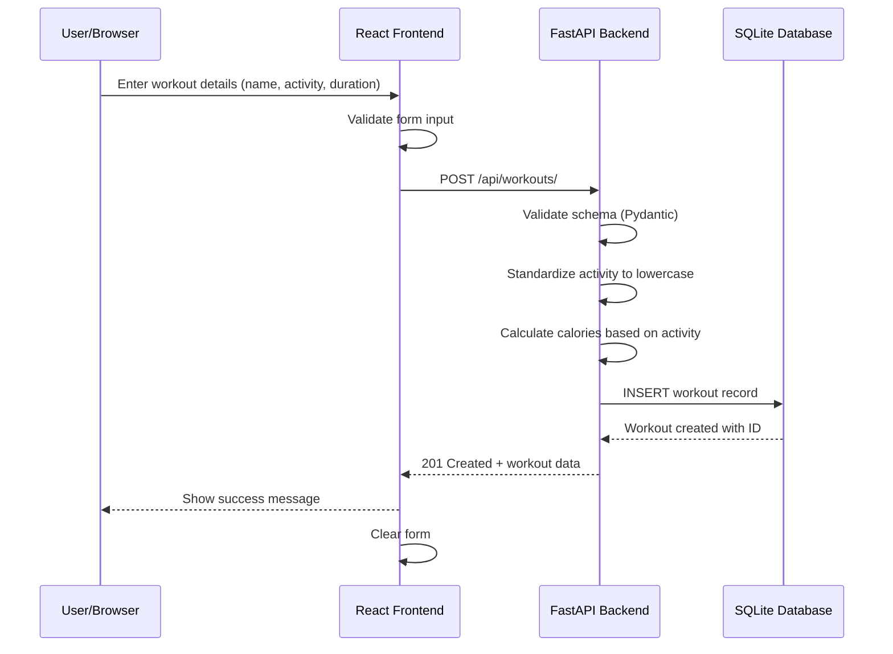
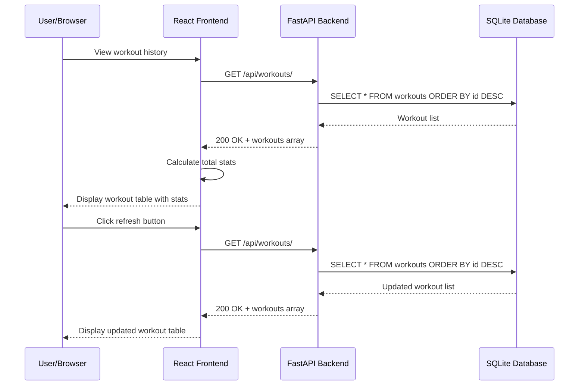
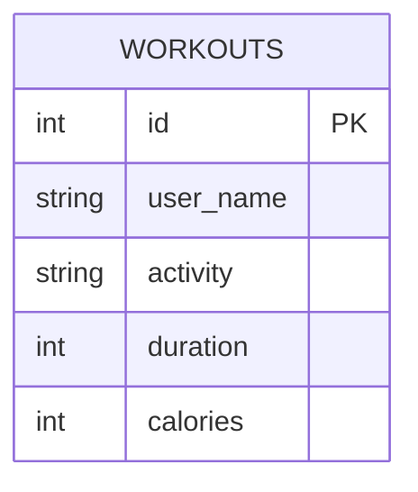

# Design Document: Fitness Tracking App

## Overview

The Fitness Tracking App is a simplified full-stack web application that enables users to log and view workout sessions. The system consists of a FastAPI backend providing RESTful APIs with SQLite database storage, and a React frontend delivering an interactive user interface. The application focuses solely on workout tracking without user authentication or exercise management, making it a straightforward logging system.

The backend leverages FastAPI's async capabilities, SQLAlchemy ORM for database abstraction, and comprehensive error handling. The frontend uses modern React functional components with hooks for state management and Axios for API communication. The architecture supports creating and retrieving workout sessions with automatic calorie calculation based on activity type.

## Architecture

```mermaid
graph TD
    subgraph "Frontend Layer"
        A[React App]
        A1[AddWorkout Component]
        A2[WorkoutList Component]
        A3[API Client - Axios]
    end
    
    subgraph "Backend Layer"
        B[FastAPI Application]
        B1[Workout Routes]
        B2[Workout Schema]
        B3[Calorie Calculator]
    end
    
    subgraph "Data Layer"
        C[SQLAlchemy ORM]
        C1[Workout Model]
        D[SQLite Database - workouts table]
    end
    
    A1 --> A3
    A2 --> A3
    A3 -->|POST /api/workouts/| B1
    A3 -->|GET /api/workouts/| B1
    B1 --> B2
    B2 --> B3
    B3 --> C1
    C1 --> D
    
    style A fill:#61dafb
    style B fill:#009688
    style D fill:#003b57
```



## Main Workflow Sequences

### Workout Creation Flow



### Workout Retrieval Flow



## Components and Interfaces

### Backend Components

#### Component 1: Workout Management (workouts.py routes)

**Purpose**: Handle workout creation and retrieval with comprehensive error handling

**Interface**:
```python
from fastapi import APIRouter, Depends, HTTPException, status
from sqlalchemy.orm import Session
from typing import List

router = APIRouter(prefix="/api/workouts", tags=["Workouts"])

@router.post("/", response_model=WorkoutResponse, status_code=status.HTTP_201_CREATED)
async def create_workout(workout: WorkoutCreate, db: Session = Depends(get_db)) -> WorkoutResponse:
    """
    Create a new workout session with automatic calorie calculation.
    Activity is standardized to lowercase for consistency.
    """
    pass

@router.get("/", response_model=List[WorkoutResponse])
async def get_workouts(db: Session = Depends(get_db)) -> List[WorkoutResponse]:
    """
    Retrieve all workouts ordered by ID descending (most recent first).
    """
    pass
```

**Responsibilities**:
- Validate workout input using Pydantic schemas
- Standardize activity names to lowercase
- Calculate calories based on activity type (running: 10 cal/min, cycling: 8 cal/min, walking: 5 cal/min, others: 6 cal/min)
- Query and manipulate workout records via SQLAlchemy
- Handle comprehensive error scenarios with structured responses
- Return appropriate HTTP status codes and error messages

#### Component 2: Database Session Management (database.py)

**Purpose**: Provide database connection and session management

**Interface**:
```python
from sqlalchemy import create_engine
from sqlalchemy.orm import declarative_base, sessionmaker, Session
from typing import Generator

SQLALCHEMY_DATABASE_URL = "sqlite:///./fitness_tracker.db"

engine = create_engine(
    SQLALCHEMY_DATABASE_URL, 
    connect_args={"check_same_thread": False},
    pool_pre_ping=True
)

SessionLocal = sessionmaker(autocommit=False, autoflush=False, bind=engine)

Base = declarative_base()

def get_db() -> Generator[Session, None, None]:
    """Dependency that provides database session"""
    pass

def init_db() -> None:
    """Initialize database tables"""
    pass
```

**Responsibilities**:
- Create and configure SQLAlchemy engine
- Provide session factory
- Manage database connections with error handling
- Initialize database schema
- Ensure proper session cleanup and rollback on errors

### Frontend Components

#### Component 3: AddWorkout Component (AddWorkout.tsx)

**Purpose**: Form for creating new workout sessions

**Interface**:
```typescript
interface AddWorkoutProps {
  onAddWorkout: (workoutData: WorkoutCreate) => Promise<{ success: boolean; error?: string }>;
}

export const AddWorkout: React.FC<AddWorkoutProps> = ({ onAddWorkout }) => {
  const [formData, setFormData] = useState<WorkoutCreate>({
    user_name: '',
    activity: '',
    duration: 0
  });
  const [submitting, setSubmitting] = useState<boolean>(false);
  const [message, setMessage] = useState<{ type: 'success' | 'error'; text: string } | null>(null);
  
  const handleChange = (e: React.ChangeEvent<HTMLInputElement>) => void;
  const handleSubmit = async (e: React.FormEvent) => Promise<void>;
  
  return JSX.Element;
};
```

**Responsibilities**:
- Render workout creation form with fields: user_name, activity, duration
- Validate user input client-side (non-empty fields, positive duration)
- Call workout creation API
- Handle submission states (submitting, success, error)
- Display success/error messages
- Clear form after successful submission
- Show hint about automatic calorie calculation

#### Component 4: WorkoutList Component (WorkoutList.tsx)

**Purpose**: Display all workouts with statistics

**Interface**:
```typescript
interface WorkoutListProps {
  workouts: Workout[];
  loading: boolean;
  onRefresh: () => void;
}

export const WorkoutList: React.FC<WorkoutListProps> = ({ workouts, loading, onRefresh }) => {
  return JSX.Element;
};
```

**Responsibilities**:
- Display workout list in table format
- Show loading state during data fetch
- Calculate and display aggregate statistics (total workouts, total duration, total calories)
- Display empty state when no workouts exist
- Provide refresh button to reload workout list
- Format activity names consistently (lowercase)
- Number workouts in reverse order (most recent first)

#### Component 5: API Client (api.ts)

**Purpose**: Centralized API communication layer

**Interface**:
```typescript
import axios, { AxiosInstance } from 'axios';

const API_BASE_URL = 'http://localhost:8000';

const apiClient = axios.create({
  baseURL: API_BASE_URL,
  headers: {
    'Content-Type': 'application/json'
  }
});

export const createWorkout = async (workoutData: WorkoutCreate): Promise<Workout>;
export const getWorkouts = async (): Promise<Workout[]>;
```

**Responsibilities**:
- Centralize all API calls
- Configure Axios instance with base URL and headers
- Provide type-safe API methods
- Handle request/response serialization
- Propagate errors to calling components

## Data Models

### Backend SQLAlchemy Model

#### Model: Workout

```python
from sqlalchemy import Column, Integer, String
from app.database import Base

class Workout(Base):
    __tablename__ = "workouts"
    
    id = Column(Integer, primary_key=True, index=True)
    user_name = Column(String(100), nullable=False)
    activity = Column(String(100), nullable=False)
    duration = Column(Integer, nullable=False)
    calories = Column(Integer, nullable=False)
```

**Validation Rules**:
- `user_name` cannot be empty (1-100 characters)
- `activity` cannot be empty (1-100 characters), automatically standardized to lowercase
- `duration` must be positive integer (> 0), cannot exceed 1440 minutes (24 hours)
- `calories` automatically calculated based on activity type

**Calorie Calculation Rules**:
- running: duration × 10 calories/min
- cycling: duration × 8 calories/min
- walking: duration × 5 calories/min
- others: duration × 6 calories/min

### Backend Pydantic Schemas

#### Schema 1: WorkoutCreate

```python
from pydantic import BaseModel, Field

class WorkoutCreate(BaseModel):
    user_name: str = Field(..., min_length=1, max_length=100, description="Name of the user")
    activity: str = Field(..., min_length=1, max_length=100, description="Type of activity")
    duration: int = Field(..., gt=0, description="Duration in minutes (must be > 0)")
```

**Purpose**: Schema for creating new workouts. Calories are calculated automatically by the backend.

#### Schema 2: WorkoutResponse

```python
from pydantic import BaseModel, Field, ConfigDict

class WorkoutResponse(BaseModel):
    id: int = Field(..., description="Unique workout identifier")
    user_name: str = Field(..., min_length=1, max_length=100, description="Name of the user")
    activity: str = Field(..., min_length=1, max_length=100, description="Type of activity")
    duration: int = Field(..., gt=0, description="Duration in minutes (must be > 0)")
    calories: int = Field(..., gt=0, description="Calories burned (must be > 0)")
    
    model_config = ConfigDict(from_attributes=True)
```

**Purpose**: Schema for API responses. Includes all workout fields including calculated calories.

### Frontend TypeScript Types

```typescript
// types/index.ts

export interface Workout {
  id: number;
  user_name: string;
  activity: string;
  duration: number;
  calories: number;
}

export interface WorkoutCreate {
  user_name: string;
  activity: string;
  duration: number;
}

export interface WorkoutUpdate {
  user_name?: string;
  activity?: string;
  duration?: number;
  calories?: number;
}
```

### Database Schema



## Key Functions with Formal Specifications

### Function 1: create_workout()

```python
async def create_workout(workout: WorkoutCreate, db: Session) -> WorkoutResponse:
    """Create a new workout session with automatic calorie calculation"""
    pass
```

**Preconditions:**
- `workout.user_name` is non-empty string (1-100 characters after stripping whitespace)
- `workout.activity` is non-empty string (1-100 characters after stripping whitespace)
- `workout.duration` is positive integer (> 0 and <= 1440 minutes)
- `db` is valid database session

**Postconditions:**
- Returns `WorkoutResponse` object with generated `id`
- Activity is standardized to lowercase in database
- Calories are calculated based on activity type:
  - running: duration × 10
  - cycling: duration × 8
  - walking: duration × 5
  - others: duration × 6
- Workout record exists in database
- If validation fails, raises `HTTPException` with status 400 and structured error detail
- If database operation fails, raises `HTTPException` with status 500 and structured error detail

**Loop Invariants:** N/A (no loops in function)

### Function 2: get_workouts()

```python
async def get_workouts(db: Session) -> List[WorkoutResponse]:
    """Retrieve all workouts ordered by ID descending"""
    pass
```

**Preconditions:**
- `db` is valid database session

**Postconditions:**
- Returns list of `WorkoutResponse` objects (may be empty)
- All workouts ordered by ID descending (most recent first)
- Activities returned in lowercase as stored
- If database operation fails, raises `HTTPException` with status 500 and structured error detail

**Loop Invariants:** 
- For list comprehension: All processed workouts are valid WorkoutResponse objects

## Algorithmic Pseudocode

### Main Processing Algorithm: Workout Creation

```python
def create_workout_algorithm(workout_data: WorkoutCreate, db: Session) -> WorkoutResponse:
    """
    Algorithm for creating a new workout with validation and calorie calculation
    
    INPUT: workout_data containing user_name, activity, duration
    OUTPUT: WorkoutResponse with calculated calories
    """
    
    # Step 1: Validate duration
    if workout_data.duration <= 0:
        raise HTTPException(
            status_code=400,
            detail={
                "error": "Invalid input",
                "message": "Duration must be greater than 0",
                "field": "duration"
            }
        )
    
    if workout_data.duration > 1440:  # 24 hours in minutes
        raise HTTPException(
            status_code=400,
            detail={
                "error": "Invalid input",
                "message": "Duration cannot exceed 1440 minutes (24 hours)",
                "field": "duration"
            }
        )
    
    # Step 2: Validate user_name is not empty
    if not workout_data.user_name or not workout_data.user_name.strip():
        raise HTTPException(
            status_code=400,
            detail={
                "error": "Invalid input",
                "message": "User name cannot be empty",
                "field": "user_name"
            }
        )
    
    # Step 3: Validate activity is not empty
    if not workout_data.activity or not workout_data.activity.strip():
        raise HTTPException(
            status_code=400,
            detail={
                "error": "Invalid input",
                "message": "Activity cannot be empty",
                "field": "activity"
            }
        )
    
    # Step 4: Standardize activity to lowercase
    standardized_activity = workout_data.activity.strip().lower()
    
    # Step 5: Calculate calories based on activity type
    calorie_rates = {
        "running": 10,
        "cycling": 8,
        "walking": 5
    }
    calorie_rate = calorie_rates.get(standardized_activity, 6)  # Default: 6 cal/min
    calculated_calories = workout_data.duration * calorie_rate
    
    # Step 6: Create workout record
    db_workout = Workout(
        user_name=workout_data.user_name.strip(),
        activity=standardized_activity,
        duration=workout_data.duration,
        calories=calculated_calories
    )
    
    # Step 7: Persist to database with error handling
    try:
        db.add(db_workout)
        db.commit()
        db.refresh(db_workout)
    except IntegrityError:
        db.rollback()
        raise HTTPException(
            status_code=500,
            detail={
                "error": "Database integrity error",
                "message": "Failed to create workout"
            }
        )
    except SQLAlchemyError:
        db.rollback()
        raise HTTPException(
            status_code=500,
            detail={
                "error": "Database error",
                "message": "An unexpected database error occurred"
            }
        )
    
    # Step 8: Return workout response
    return WorkoutResponse.model_validate(db_workout)
```

**Preconditions:**
- workout_data.user_name is provided (may be empty, validated in algorithm)
- workout_data.activity is provided (may be empty, validated in algorithm)
- workout_data.duration is provided (may be invalid, validated in algorithm)
- db session is active and connected

**Postconditions:**
- Workout record created in database with standardized activity and calculated calories
- Returns WorkoutResponse with generated ID
- Raises HTTPException with appropriate status code if validation or database operation fails
- Activity stored in lowercase
- Calories calculated based on activity type

**Loop Invariants:** N/A

### Retrieval Algorithm: Get All Workouts

```python
def get_workouts_algorithm(db: Session) -> List[WorkoutResponse]:
    """
    Algorithm for retrieving all workouts ordered by ID descending
    
    INPUT: db session
    OUTPUT: List of WorkoutResponse objects
    """
    
    # Step 1: Query all workouts ordered by ID descending
    try:
        workouts = db.query(Workout).order_by(Workout.id.desc()).all()
    except OperationalError:
        raise HTTPException(
            status_code=500,
            detail={
                "error": "Database connection error",
                "message": "Failed to connect to the database"
            }
        )
    except SQLAlchemyError:
        raise HTTPException(
            status_code=500,
            detail={
                "error": "Database error",
                "message": "An unexpected database error occurred"
            }
        )
    
    # Step 2: Convert to response models
    return [WorkoutResponse.model_validate(workout) for workout in workouts]
```

**Preconditions:**
- db session is active

**Postconditions:**
- Returns list of workouts (may be empty)
- All workouts ordered by ID descending (most recent first)
- Raises HTTPException if database operation fails

**Loop Invariants:**
- For list comprehension: All processed workouts are valid Workout model instances

### Calorie Calculation Algorithm

```python
def calculate_calories(activity: str, duration: int) -> int:
    """
    Algorithm for calculating calories based on activity type and duration
    
    INPUT: activity (string), duration (minutes)
    OUTPUT: calories (integer)
    """
    
    # Step 1: Define calorie rates per minute for known activities
    calorie_rates = {
        "running": 10,
        "cycling": 8,
        "walking": 5
    }
    
    # Step 2: Get calorie rate for activity (default to 6 for unknown activities)
    calorie_rate = calorie_rates.get(activity.lower(), 6)
    
    # Step 3: Calculate total calories
    calories = duration * calorie_rate
    
    # Step 4: Return calculated calories
    return calories
```

**Preconditions:**
- activity is non-empty string
- duration is positive integer

**Postconditions:**
- Returns positive integer representing calories burned
- Uses activity-specific rate if activity is known (running, cycling, walking)
- Uses default rate (6 cal/min) for unknown activities

**Loop Invariants:** N/A

## Example Usage

### Backend API Usage Examples

```python
# Example 1: Create Workout
from fastapi import FastAPI, Depends
from sqlalchemy.orm import Session

app = FastAPI()

@app.post("/api/workouts/")
async def create(workout: WorkoutCreate, db: Session = Depends(get_db)):
    """
    Create a new workout with automatic calorie calculation
    
    Request body:
    {
        "user_name": "John Doe",
        "activity": "Running",
        "duration": 45
    }
    
    Response (201):
    {
        "id": 1,
        "user_name": "John Doe",
        "activity": "running",
        "duration": 45,
        "calories": 450
    }
    """
    new_workout = await create_workout(workout, db)
    return new_workout

# Example 2: Get All Workouts
@app.get("/api/workouts/")
async def list_workouts(db: Session = Depends(get_db)):
    """
    Retrieve all workouts ordered by ID descending
    
    Response (200):
    [
        {
            "id": 2,
            "user_name": "Jane Smith",
            "activity": "cycling",
            "duration": 60,
            "calories": 480
        },
        {
            "id": 1,
            "user_name": "John Doe",
            "activity": "running",
            "duration": 45,
            "calories": 450
        }
    ]
    """
    workouts = await get_workouts(db)
    return workouts

# Example 3: Health Check
@app.get("/health")
async def health_check():
    """
    Check API and database health
    
    Response (200):
    {
        "status": "healthy",
        "message": "API is running",
        "database": "connected"
    }
    """
    return {
        "status": "healthy",
        "message": "API is running",
        "database": "connected"
    }
```

### Frontend Component Usage Examples

```typescript
// Example 1: Create Workout
const App: React.FC = () => {
  const [workouts, setWorkouts] = useState<Workout[]>([]);
  const [loading, setLoading] = useState<boolean>(true);
  
  const handleAddWorkout = async (workoutData: WorkoutCreate): Promise<{ success: boolean; error?: string }> => {
    try {
      const newWorkout = await createWorkout(workoutData);
      console.log('Workout created:', newWorkout);
      
      // Refresh workout list
      await fetchWorkouts();
      
      return { success: true };
    } catch (error) {
      console.error('Failed to create workout:', error);
      return { 
        success: false, 
        error: error.response?.data?.detail?.message || 'Failed to create workout'
      };
    }
  };
  
  const fetchWorkouts = async () => {
    setLoading(true);
    try {
      const data = await getWorkouts();
      setWorkouts(data);
    } catch (error) {
      console.error('Failed to fetch workouts:', error);
    } finally {
      setLoading(false);
    }
  };
  
  useEffect(() => {
    fetchWorkouts();
  }, []);
  
  return (
    <div className="app">
      <h1>🏋️ Fitness Tracking App</h1>
      <AddWorkout onAddWorkout={handleAddWorkout} />
      <WorkoutList 
        workouts={workouts} 
        loading={loading} 
        onRefresh={fetchWorkouts} 
      />
    </div>
  );
};

// Example 2: Display Workout Statistics
const WorkoutList: React.FC<WorkoutListProps> = ({ workouts, loading, onRefresh }) => {
  // Calculate aggregate statistics
  const totalWorkouts = workouts.length;
  const totalDuration = workouts.reduce((sum, w) => sum + w.duration, 0);
  const totalCalories = workouts.reduce((sum, w) => sum + w.calories, 0);
  
  if (loading) {
    return <div className="loading">⏳ Loading workouts...</div>;
  }
  
  return (
    <div className="workout-list-container">
      <div className="list-header">
        <h2>📋 Workout History</h2>
        <button onClick={onRefresh} className="refresh-btn">
          🔄 Refresh
        </button>
      </div>
      
      <div className="workout-stats">
        <div className="stat">
          <span className="stat-label">Total Workouts:</span>
          <span className="stat-value">{totalWorkouts}</span>
        </div>
        <div className="stat">
          <span className="stat-label">Total Duration:</span>
          <span className="stat-value">{totalDuration} min</span>
        </div>
        <div className="stat">
          <span className="stat-label">Total Calories:</span>
          <span className="stat-value">{totalCalories} cal</span>
        </div>
      </div>
      
      <table className="workout-table">
        <thead>
          <tr>
            <th>#</th>
            <th>User Name</th>
            <th>Activity</th>
            <th>Duration (min)</th>
            <th>Calories</th>
          </tr>
        </thead>
        <tbody>
          {workouts.map((workout, index) => (
            <tr key={workout.id}>
              <td>{workouts.length - index}</td>
              <td>{workout.user_name}</td>
              <td>
                <span className="activity-badge">
                  {workout.activity.toLowerCase()}
                </span>
              </td>
              <td>{workout.duration}</td>
              <td>{workout.calories}</td>
            </tr>
          ))}
        </tbody>
      </table>
    </div>
  );
};

// Example 3: Form Validation
const AddWorkout: React.FC<AddWorkoutProps> = ({ onAddWorkout }) => {
  const [formData, setFormData] = useState<WorkoutCreate>({
    user_name: '',
    activity: '',
    duration: 0
  });
  
  const handleSubmit = async (e: React.FormEvent) => {
    e.preventDefault();
    
    // Client-side validation
    if (!formData.user_name.trim()) {
      setMessage({ type: 'error', text: 'Please enter your name' });
      return;
    }
    if (!formData.activity.trim()) {
      setMessage({ type: 'error', text: 'Please enter an activity' });
      return;
    }
    if (formData.duration <= 0) {
      setMessage({ type: 'error', text: 'Duration must be greater than 0' });
      return;
    }
    
    // Submit to API
    const result = await onAddWorkout(formData);
    
    if (result.success) {
      setMessage({ type: 'success', text: '✅ Workout added successfully!' });
      // Clear form
      setFormData({ user_name: '', activity: '', duration: 0 });
    } else {
      setMessage({ type: 'error', text: `❌ ${result.error}` });
    }
  };
  
  return (
    <form onSubmit={handleSubmit} className="workout-form">
      {/* Form fields */}
    </form>
  );
};
```

## Correctness Properties

*A property is a characteristic or behavior that should hold true across all valid executions of a system—essentially, a formal statement about what the system should do. Properties serve as the bridge between human-readable specifications and machine-verifiable correctness guarantees.*

### Property 1: Workout Creation with Unique ID

*For any* valid workout data (user_name, activity, duration), creating a workout SHALL produce a new workout record with a unique ID and calculated calories.

### Property 2: Activity Standardization

*For any* workout creation, the activity name SHALL be standardized to lowercase before storage, ensuring consistent data format.

### Property 3: Calorie Calculation Accuracy

*For any* workout, calories SHALL be calculated based on activity type: running (10 cal/min), cycling (8 cal/min), walking (5 cal/min), others (6 cal/min).

### Property 4: Duration Validation

*For any* workout with duration less than or equal to zero, the system SHALL reject the creation request with a 400 error.

### Property 5: Duration Maximum Limit

*For any* workout with duration exceeding 1440 minutes (24 hours), the system SHALL reject the creation request with a 400 error.

### Property 6: User Name Validation

*For any* workout with empty or whitespace-only user_name, the system SHALL reject the creation request with a 400 error.

### Property 7: Activity Validation

*For any* workout with empty or whitespace-only activity, the system SHALL reject the creation request with a 400 error.

### Property 8: Activity Length Validation

*For any* workout with activity name exceeding 100 characters, the system SHALL reject the creation request with a 400 error.

### Property 9: Workout Retrieval Ordering

*For any* workout list retrieval, the results SHALL be ordered by ID in descending order (most recent first).

### Property 10: Validation Error Response Format

*For any* request with invalid data that fails Pydantic schema validation, the system SHALL return a 422 status code with detailed field-specific error messages.

### Property 11: Required Field Validation

*For any* request missing required fields (user_name, activity, duration), the system SHALL reject the request with a validation error.

### Property 12: Response Schema Compliance

*For any* successful API request, the response SHALL match the defined Pydantic response schema with all required fields present (id, user_name, activity, duration, calories).

### Property 13: HTTP Status Code Correctness

*For any* API operation, the system SHALL return the appropriate HTTP status code (201 for creation, 200 for retrieval, 400 for validation errors, 422 for schema errors, 500 for server errors).

### Property 14: Error Response Consistency

*For any* error condition, the system SHALL return a consistent structured error response format with error type, message, and optional field/hint information.

### Property 15: Database Integrity

*For any* successful workout creation, the workout record SHALL be persisted to the database and retrievable via the GET endpoint.

### Property 16: Frontend Error Display

*For any* API error, the frontend SHALL display a user-friendly error message to the user.

### Property 17: Frontend Client-Side Validation

*For any* invalid form input, the frontend SHALL validate and catch the error before submitting to the backend.

### Property 18: API Client Header Configuration

*For any* API request from the frontend, the API client SHALL set the Content-Type header to application/json.

### Property 19: API Client Error Handling

*For any* HTTP error response, the API client SHALL provide meaningful error information to the calling component.

### Property 20: Frontend Statistics Calculation

*For any* workout list display, the frontend SHALL correctly calculate and display aggregate statistics (total workouts, total duration, total calories).


## Error Handling

### Error Scenario 1: Invalid Workout Data

**Condition**: User submits workout with invalid data (empty fields, negative duration, duration > 1440 minutes)

**Response**: 
- Backend raises `HTTPException` with status code 400
- Structured error response with error type, message, and field information
- Example: `{"error": "Invalid input", "message": "Duration must be greater than 0", "field": "duration"}`

**Recovery**: 
- Frontend displays field-specific error message
- User corrects input and resubmits
- Form highlights invalid field

### Error Scenario 2: Database Connection Failure

**Condition**: Database is unavailable or connection fails during workout creation or retrieval

**Response**:
- Backend raises `HTTPException` with status code 500
- Error message: "Database connection error" or "Database error"
- Detailed error logged for debugging

**Recovery**:
- Frontend displays "Service unavailable" or "Database error" message
- User can retry the operation
- Show user-friendly error page

### Error Scenario 3: Validation Errors (Pydantic)

**Condition**: Request data fails Pydantic schema validation (e.g., missing required fields, wrong data types)

**Response**:
- Backend raises `HTTPException` with status code 422
- Error message includes field-specific validation errors
- Example: `{"error": "Validation error", "message": "The request contains invalid data", "details": [...]}`

**Recovery**:
- Frontend displays field-specific error messages
- Highlight invalid fields in form
- User corrects input and resubmits

### Error Scenario 4: Network Request Failure

**Condition**: Frontend cannot reach backend API (network error, timeout, CORS issue)

**Response**:
- Axios throws network error
- Frontend catches error in try-catch block

**Recovery**:
- Display "Network error" or "Failed to connect" message to user
- Provide retry button
- Check CORS configuration if persistent

### Error Scenario 5: Empty Workout List

**Condition**: No workouts exist in the database

**Response**:
- Backend returns empty array with status code 200
- No error raised (this is valid state)

**Recovery**:
- Frontend displays empty state message: "No workouts yet. Add your first workout above! 💪"
- Show add workout form prominently

## Testing Strategy

### Unit Testing Approach

**Backend Unit Tests (pytest)**:
- Test workout creation with valid data
- Test workout creation with invalid data (empty fields, negative duration, excessive duration)
- Test activity standardization to lowercase
- Test calorie calculation for different activity types
- Test workout retrieval ordering (ID descending)
- Test database error handling
- Test Pydantic schema validation
- Coverage goal: >80% for backend code

**Key Test Cases**:
1. Workout creation with valid data returns 201 and correct response
2. Workout creation with empty user_name returns 400 error
3. Workout creation with empty activity returns 400 error
4. Workout creation with duration <= 0 returns 400 error
5. Workout creation with duration > 1440 returns 400 error
6. Activity "Running" is standardized to "running"
7. Calorie calculation: running (10 cal/min), cycling (8 cal/min), walking (5 cal/min), others (6 cal/min)
8. Workout retrieval returns workouts ordered by ID descending
9. Database connection error returns 500 error
10. Pydantic validation error returns 422 error

**Frontend Unit Tests (Jest + React Testing Library)**:
- Test AddWorkout component rendering
- Test WorkoutList component rendering
- Test form validation (client-side)
- Test user interactions (button clicks, form submissions)
- Mock API client responses
- Test error handling and display
- Test statistics calculation
- Coverage goal: >70% for frontend components

**Key Test Cases**:
1. AddWorkout form renders correctly with all fields
2. AddWorkout validates empty user_name before submission
3. AddWorkout validates empty activity before submission
4. AddWorkout validates duration <= 0 before submission
5. WorkoutList displays workouts from API
6. WorkoutList calculates total statistics correctly
7. WorkoutList displays empty state when no workouts
8. Error messages display when API calls fail
9. Success message displays after workout creation
10. Loading states display during API calls

### Property-Based Testing Approach

**Property Test Library**: Hypothesis (Python backend), fast-check (TypeScript frontend)

**Backend Properties to Test**:
1. **Activity Standardization**: For any activity string, the stored value is always lowercase
2. **Calorie Calculation Consistency**: For any duration and activity, calories = duration × rate (where rate is determined by activity)
3. **Non-Negative Constraints**: All numeric fields (duration, calories) are always positive after creation
4. **Ordering Consistency**: Workout list is always ordered by ID descending

**Frontend Properties to Test**:
1. **Form Validation Consistency**: Invalid inputs always produce error messages before submission
2. **Statistics Calculation**: Sum of workout durations/calories always equals displayed totals
3. **API Response Handling**: All API responses are properly typed and handled

### Integration Testing Approach

**Backend Integration Tests**:
- Use TestClient from FastAPI
- Test complete request-response cycles
- Use in-memory SQLite database for testing
- Test CORS configuration
- Test error handling across layers

**Key Integration Test Scenarios**:
1. Complete workout creation flow (API → DB → Response)
2. Create workout and verify it appears in GET /api/workouts/
3. Create multiple workouts and verify ordering
4. Test activity standardization end-to-end
5. Test calorie calculation end-to-end
6. Handle concurrent requests safely
7. Database error propagation to API response

**Frontend Integration Tests**:
- Test complete user workflows
- Mock backend API with MSW (Mock Service Worker)
- Test state management across components

**Key Integration Test Scenarios**:
1. Create workout → Verify appears in list
2. Create workout → Verify statistics update
3. Refresh button → Verify list updates
4. Error handling → Display error → Retry
5. Form submission → Success message → Form clears

## Performance Considerations

### Database Optimization

1. **Indexing Strategy**:
   - Primary key (id) automatically indexed
   - Consider adding index on activity for filtering (future enhancement)
   - SQLite performs well for small to medium datasets

2. **Query Optimization**:
   - Simple queries (SELECT * with ORDER BY) are efficient
   - No complex joins or relationships in current implementation
   - Pagination can be added if workout list grows large (future enhancement)

### API Performance

1. **Async Operations**:
   - Leverage FastAPI's async capabilities for I/O-bound operations
   - Database operations are synchronous (SQLite limitation)

2. **Response Optimization**:
   - Use Pydantic's `model_validate` for efficient ORM to schema conversion
   - Responses are lightweight (no nested relationships)

### Frontend Performance

1. **State Management**:
   - Use React hooks efficiently (useState, useEffect)
   - Avoid unnecessary re-renders
   - Simple state management (no Redux needed for current scope)

2. **API Call Optimization**:
   - Fetch workouts once on mount
   - Refresh only when user clicks refresh button
   - Consider caching API responses in memory (future enhancement)

### Scalability Considerations

1. **Database Migration Path**:
   - SQLite suitable for development and small deployments
   - Migration path to PostgreSQL for production scale
   - Current schema is simple and portable

2. **Horizontal Scaling**:
   - FastAPI supports multiple worker processes
   - Stateless API design enables load balancing
   - Separate database server for production

## Security Considerations

### Input Validation

1. **Schema Validation**:
   - Use Pydantic for all request validation
   - Validate data types, ranges, and formats
   - Sanitize string inputs (trim whitespace)
   - Enforce maximum lengths (user_name: 100 chars, activity: 100 chars, duration: 1440 minutes)

2. **SQL Injection Prevention**:
   - Use SQLAlchemy ORM (parameterized queries)
   - Never construct raw SQL from user input
   - ORM handles all query parameterization

3. **XSS Prevention**:
   - React automatically escapes rendered content
   - No HTML content accepted in current implementation
   - Set appropriate Content-Security-Policy headers (future enhancement)

### API Security

1. **CORS Configuration**:
   - Configure allowed origins explicitly (localhost:5173, localhost:3000)
   - Don't use wildcard (*) in production
   - Set appropriate CORS headers

2. **Rate Limiting** (Future Enhancement):
   - Implement rate limiting per IP
   - Prevent abuse of API endpoints
   - Use slowapi or similar library

3. **HTTPS**:
   - Enforce HTTPS in production
   - Set Secure flag on cookies (when authentication added)
   - Implement HSTS headers

### Data Privacy

1. **Sensitive Data Handling**:
   - No passwords or authentication in current implementation
   - Log only non-sensitive information
   - Implement data retention policies (future enhancement)

2. **Database Security**:
   - Use environment variables for database credentials (when needed)
   - Restrict database access to application only
   - Regular backups with encryption (production)

### Future Security Enhancements

1. **Authentication**:
   - Implement JWT token-based authentication
   - Add user authentication and authorization
   - Secure password hashing with bcrypt

2. **Authorization**:
   - Verify user owns resources before allowing access
   - Implement middleware to check user permissions
   - Prevent users from accessing other users' workouts

## Dependencies

### Backend Dependencies (requirements.txt)

```txt
# Web Framework
fastapi==0.104.1
uvicorn[standard]==0.24.0

# Database
sqlalchemy==2.0.23

# Validation
pydantic==2.5.0

# CORS
python-multipart==0.0.6

# Testing
pytest==7.4.3
pytest-asyncio==0.21.1
httpx==0.25.1
```

**Note**: No password hashing library (bcrypt) needed in current simplified implementation. No Alembic needed as database schema is simple and stable.

### Frontend Dependencies (package.json)

```json
{
  "dependencies": {
    "react": "^18.2.0",
    "react-dom": "^18.2.0",
    "axios": "^1.6.2"
  },
  "devDependencies": {
    "@types/react": "^18.2.42",
    "@types/react-dom": "^18.2.17",
    "@vitejs/plugin-react": "^4.2.1",
    "typescript": "^5.3.3",
    "vite": "^5.0.5",
    "@testing-library/react": "^14.1.2",
    "@testing-library/jest-dom": "^6.1.5",
    "vitest": "^1.0.4"
  }
}
```

**Note**: No react-router-dom needed as application is single-page without navigation.

### External Services

- **SQLite**: Embedded database (no external service required)
- **Future Enhancements**: 
  - PostgreSQL for production database
  - Redis for caching (if needed)
  - Authentication service (when user management added)

## Project Structure

### Backend Structure

```
backend/
├── app/
│   ├── __init__.py
│   ├── main.py                 # FastAPI application entry point
│   ├── database.py             # Database configuration and session
│   ├── models/                 # SQLAlchemy models
│   │   ├── __init__.py
│   │   └── workout.py          # Workout model only
│   ├── schemas/                # Pydantic schemas
│   │   ├── __init__.py
│   │   └── workout.py          # Workout schemas only
│   └── routes/                 # API route handlers
│       ├── __init__.py
│       └── workouts.py         # Workout routes only
├── tests/                      # Test files
│   ├── __init__.py
│   ├── test_database.py
│   ├── test_database_integration.py
│   ├── test_workout_creation.py
│   ├── test_workout_model.py
│   ├── test_workout_modification.py
│   ├── test_workout_retrieval.py
│   ├── test_workout_retrieval_integration.py
│   └── test_workout_schema.py
├── requirements.txt            # Python dependencies
├── run_server.bat              # Start backend server
├── recreate_db.bat             # Recreate database
└── fitness_tracker.db          # SQLite database file (generated)
```

**Note**: No alembic/ directory (no migrations needed for simple schema). No user.py, exercise.py, or auth.py files.

### Frontend Structure

```
frontend/
├── public/
│   └── index.html
├── src/
│   ├── components/             # React components
│   │   ├── AddWorkout.tsx      # Workout creation form
│   │   ├── AddWorkout.css
│   │   ├── WorkoutList.tsx     # Workout list display
│   │   └── WorkoutList.css
│   ├── services/               # API client
│   │   └── api.ts              # Axios API client
│   ├── types/                  # TypeScript types
│   │   └── index.ts            # Workout types
│   ├── App.tsx                 # Main app component
│   ├── App.css
│   ├── main.tsx                # Entry point
│   └── index.css               # Global styles
├── package.json                # Node dependencies
├── tsconfig.json               # TypeScript configuration
└── vite.config.ts              # Vite configuration
```

**Note**: No auth/, exercises/, pages/, or common/ directories. Single-page application with two main components.

### Root Structure

```
fitness-tracking-app/
├── backend/                    # Backend application
├── frontend/                   # Frontend application
├── setupdev.bat                # Development environment setup script
├── runapplication.bat          # Application startup script
├── ERROR_HANDLING_GUIDE.md     # Error handling documentation
├── ERROR_HANDLING_SUMMARY.md   # Error handling summary
├── CLEANUP_SUMMARY.md          # Cleanup documentation
└── README.md                   # Project documentation
```

### Setup Scripts

#### setupdev.bat

```batch
@echo off
echo Setting up Fitness Tracking App development environment...

REM Setup backend
echo.
echo Setting up backend...
cd backend
python -m venv venv
call venv\Scripts\activate
pip install -r requirements.txt
cd ..

REM Setup frontend
echo.
echo Setting up frontend...
cd frontend
call npm install
cd ..
cd ..

echo.
echo Setup complete! Run runapplication.bat to start the application.
pause
```

#### runapplication.bat

```batch
@echo off
echo Starting Fitness Tracking App...

REM Start backend
echo Starting backend server...
start "Backend Server" cmd /k "cd backend && venv\Scripts\activate && uvicorn app.main:app --reload --host 0.0.0.0 --port 8000"

REM Wait for backend to start
timeout /t 5 /nobreak

REM Start frontend
echo Starting frontend development server...
start "Frontend Server" cmd /k "cd frontend && npm run dev"

echo.
echo Application started!
echo Backend: http://localhost:8000
echo Frontend: http://localhost:5173
echo API Docs: http://localhost:8000/docs
pause
```

### README.md Structure

```markdown
# Fitness Tracking App

Simplified full-stack fitness tracking application built with FastAPI and React.

## Features

- Workout session logging (user name, activity, duration)
- Automatic calorie calculation based on activity type
- Workout history with statistics
- RESTful API with automatic documentation
- Comprehensive error handling

## Tech Stack

**Backend:**
- FastAPI (Python web framework)
- SQLAlchemy ORM
- SQLite database
- Pydantic (validation)

**Frontend:**
- React with TypeScript
- Axios for API calls
- Vite for build tooling

## Getting Started

### Prerequisites

- Python 3.9+
- Node.js 18+
- npm or yarn

### Installation

Run the setup script:
```bash
setupdev.bat
```

This will:
1. Create Python virtual environment
2. Install backend dependencies
3. Initialize database
4. Install frontend dependencies

### Running the Application

```bash
runapplication.bat
```

This starts:
- Backend API server on http://localhost:8000
- Frontend dev server on http://localhost:5173
- API documentation on http://localhost:8000/docs

### Manual Setup

**Backend:**
```bash
cd backend
python -m venv venv
venv\Scripts\activate
pip install -r requirements.txt
python recreate_db.py
uvicorn app.main:app --reload
```

**Frontend:**
```bash
cd frontend
npm install
npm run dev
```

## API Endpoints

### Workouts
- POST /api/workouts/ - Create workout
- GET /api/workouts/ - List all workouts

### Health
- GET /health - Health check
- GET / - API information

## Calorie Calculation

Calories are automatically calculated based on activity type:
- Running: 10 calories/minute
- Cycling: 8 calories/minute
- Walking: 5 calories/minute
- Others: 6 calories/minute

## Testing

**Backend:**
```bash
cd backend
pytest
```

**Frontend:**
```bash
cd frontend
npm test
```

## Project Structure

See design document for detailed structure.

## License

MIT
```

## Implementation Notes

### Development Workflow

1. **Initial Setup**:
   - Run `setupdev.bat` to configure environment
   - Verify database created successfully (fitness_tracker.db)
   - Check both servers start without errors

2. **Development Process**:
   - Backend changes auto-reload with uvicorn --reload
   - Frontend changes hot-reload with Vite HMR
   - Use FastAPI docs (http://localhost:8000/docs) for API testing

3. **Database Changes**:
   - Modify SQLAlchemy models in `backend/app/models/workout.py`
   - Run `recreate_db.bat` to recreate database with new schema
   - Note: No migrations needed for simple schema

4. **Adding New Features**:
   - Define or modify SQLAlchemy model
   - Create or update Pydantic schemas
   - Implement route handlers
   - Add frontend components
   - Write tests
   - Update documentation

### Best Practices

1. **Backend**:
   - Always use Pydantic schemas for validation
   - Use dependency injection for database sessions
   - Handle exceptions with appropriate HTTP status codes
   - Write docstrings for all functions
   - Use type hints throughout
   - Log errors with structured information

2. **Frontend**:
   - Use TypeScript for type safety
   - Handle loading states
   - Validate forms before submission
   - Display user-friendly error messages
   - Use environment variables for API URL (future)

3. **Database**:
   - Use SQLAlchemy ORM for all queries
   - Never construct raw SQL from user input
   - Backup database before schema changes
   - Test with sample data

4. **Security**:
   - Never commit database files
   - Validate all user input
   - Implement proper error messages (don't leak sensitive info)
   - Keep dependencies updated

### Future Enhancements

1. **Authentication**:
   - User registration and login
   - JWT token-based authentication
   - Password hashing with bcrypt
   - User-specific workout filtering

2. **Features**:
   - Exercise tracking within workouts
   - Progress tracking and statistics
   - Workout plans and scheduling
   - Data visualization (charts, graphs)
   - Export workout data

3. **Infrastructure**:
   - Docker containerization
   - CI/CD pipeline
   - Production deployment guide
   - Monitoring and logging
   - Database backups

4. **Performance**:
   - Pagination for workout lists
   - Caching frequently accessed data
   - Database query optimization
   - CDN for static assets

5. **Testing**:
   - Increase test coverage
   - Add E2E tests with Playwright
   - Performance testing
   - Load testing
